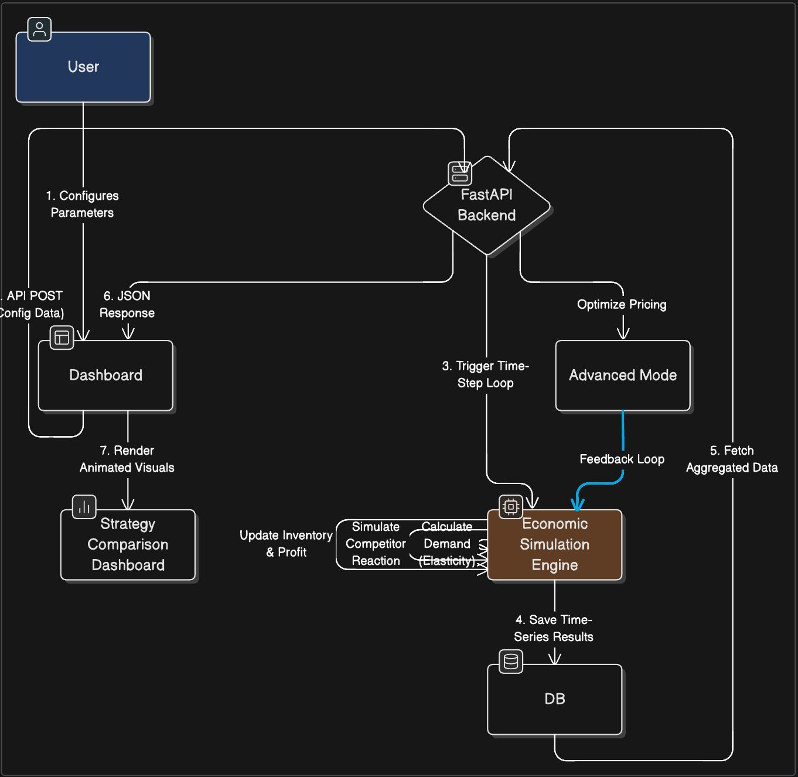

# ElasticEdge

### AI-Powered Dynamic Pricing Economic Simulation Platform

---
## Folder-Structure of Src and Purpose
<pre>
src/
├── assets/            # Static files (images, fonts, etc.)
│   └── (images from the recent commit) 
│
├── components/          # Reusable UI components
│   ├── Dashboard/       # Main simulation dashboard
│   ├── Charts/          # Recharts/D3 visualization components
│   ├── SimulationForm/  # Input forms for configuration
│   ├── StrategyCard/    # Pricing strategy selection cards
│   └── ComparisonView/  # Strategy comparison interface
│
├── pages/               # Page-level components
│   ├── Home.jsx         # Landing page
│   ├── Simulation.jsx   # Main simulation page
│   └── Results.jsx      # Results and analysis page
│
├── services/            # API communication layer
│   ├── api.js           # Axios/fetch setup for backend calls
│   └── simulationService.js  # Functions to call /api/simulations
│
├── hooks/               # Custom React hooks
│   ├── useSimulation.js # Hook to manage simulation state
│   └── useChartData.js  # Hook to format data for charts
│
├── utils/               # Helper functions
│   ├── calculations.js  # Frontend math helpers
│   ├── formatters.js    # Format currency, percentages
│   └── validators.js    # Form validation utilities
│
├── context/             # Global state management
│   └── SimulationContext.jsx  # Share simulation data across components
│
├── styles/              # CSS / Tailwind styles
│   └── index.css        # Tailwind directives and global styles
│
├── App.jsx              # Main application component with routing
├── main.jsx             # Entry point - renders App to DOM
├── index.css            # Global styles
└── vite.config.js       # Vite configuration (located in root)
</pre>
##  One-line Description

ElasticEdge is an AI-powered economic simulation platform that enables businesses to experiment with dynamic pricing strategies under realistic market conditions including demand elasticity, competitor behavior, and inventory constraints.

---

#  Problem Statement

## Problem Title

**Dynamic Pricing Simulation Under Competitive Market Constraints**

## Problem Description

In competitive e-commerce markets, pricing decisions directly impact revenue, market share, and inventory turnover.

Businesses often rely on:

* Static spreadsheets
* Limited historical data
* Manual pricing decisions

There is no interactive simulation system that models:

* Demand elasticity
* Competitor price reactions
* Inventory constraints
* Multi-variable economic interactions

Without predictive simulation, pricing experimentation carries significant financial risk.

---

#  Target Users

* E-commerce businesses
* MBA students (Economics / Strategy)
* Business analysts
* Startup founders
* D2C brands

---

#  Existing Gaps

| Current Methods          | Limitations                   |
| ------------------------ | ----------------------------- |
| Static spreadsheets      | No dynamic simulation         |
| Historical data analysis | No predictive experimentation |
| Manual pricing decisions | Reactive, not strategic       |
| Basic dashboards         | No multi-variable modeling    |

---

#  Problem Understanding & Approach

## Root Cause Analysis

* Pricing decisions lack predictive simulation tools
* Competitor reactions are unpredictable
* Inventory constraints are not integrated with pricing
* Short-term strategies often hurt long-term profitability

## Solution Strategy

Build a **modular economic simulation engine** that:

* Models demand elasticity mathematically
* Simulates competitor behavior
* Tracks inventory changes over time
* Runs pricing strategies across simulated time periods
* Visualizes revenue, profit, and market share dynamically

---

#  Proposed Solution

## Solution Overview

ElasticEdge is an interactive economic simulation engine that allows users to configure product parameters and test pricing strategies in a controlled virtual market.

## Core Components

The system integrates:

* Demand model
* Competitor reaction model
* Inventory model
* Pricing strategy engine
* Time-based simulation loop

---

#  Key Features

* Interactive pricing control panel
* Demand elasticity modeling
* Competitor reaction simulation
* Inventory constraint modeling
* Revenue & profit tracking
* Market share estimation
* Strategy comparison dashboard
* Animated time-series charts
* AI-based pricing agent (Advanced Mode)

---

#  System Architecture

## High-Level Flow

User → Frontend → Backend → Simulation Engine → Database → API Response → Visualization

## Architecture Description

1. User configures simulation parameters via dashboard
2. Backend triggers simulation engine
3. Engine runs time-based economic model
4. Results stored in database
5. API returns processed results
6. Frontend renders dynamic charts and comparisons

---

# Database Design

## Entities

* User
* Simulation
* Product
* Competitor
* Strategy
* SimulationResults

## Relationships

* One user → Multiple simulations
* One simulation → One product configuration
* One simulation → Multiple time-step results

---

# Dataset

## Dataset Name

Synthetic Market Simulation Dataset

## Source

Generated using internal simulation engine

## Data Type

* Time-series pricing data
* Demand values
* Inventory levels
* Revenue and profit metrics

## Selection Reason

Real-world pricing data is proprietary.
Synthetic data allows controlled experimentation.

---

#  Preprocessing Steps

* Normalization of price variables
* Scaling elasticity parameters
* Handling stockout edge cases
* Time-step aggregation

---

#  Model Design

## Model Name

Elastic Demand Simulation Model with Competitor Reaction

## Selection Reasoning

* Interpretable
* Mathematically grounded
* Suitable for controlled simulation

---

## Alternatives Considered

* Linear regression demand model
* ARIMA time-series forecasting
* Reinforcement learning pricing agent

---

#  Evaluation Metrics

* Total Revenue
* Total Profit
* Market Share
* Inventory Turnover Ratio
* Stockout Frequency

---

#  Technology Stack

## Frontend

* React.js
* Tailwind CSS
* Recharts / D3.js

## Backend

*  JavaScript

## Database

* Supabase

## Deployment

* Netlify

---

# Module-wise Development Plan

## Checkpoint 1: Research & Planning

* Economic model design
* Architecture design
* UI wireframes

## Checkpoint 2: Backend Development

* Simulation engine
* API endpoints
* Database schema

## Checkpoint 3: Frontend Development

* Interactive dashboard
* Chart integration
* Strategy selection UI

## Checkpoint 4: AI Mode Development

* Reinforcement learning pricing agent
* Performance evaluation

## Checkpoint 5: Model Integration

* API-model connection
* Real-time simulation updates

## Checkpoint 6: Deployment
 
* Cloud deployment
* Live demo

---

#  End-to-End Workflow

1. User logs in
2. Configures product & market parameters
3. Selects pricing strategy
4. Runs simulation
5. Backend executes time-based economic model
6. Results stored and returned
7. Frontend visualizes revenue, profit & inventory
8. User compares strategies

---

# Deliverables

* Functional simulation engine
* Interactive dashboard
* Strategy comparison feature
* Deployment-ready system

---

# Future Scope

* Customer segmentation modeling
* Shock event simulation
* Real-time Shopify integration
* Live competitor price scraping
* Enterprise SaaS version
* Advanced reinforcement learning pricing
* Multi-agent competitive simulation

---

# Known Limitations

* Uses synthetic data
* Assumes rational competitor behavior
* Simplified elasticity model
* Market share is estimated, not real-world verified

---

# 🌍Impact

* Enables risk-free pricing experimentation
* Reduces financial uncertainty
* Improves revenue optimization
* Encourages data-driven decision-making
* Acts as a learning tool for economics & strategy

---

